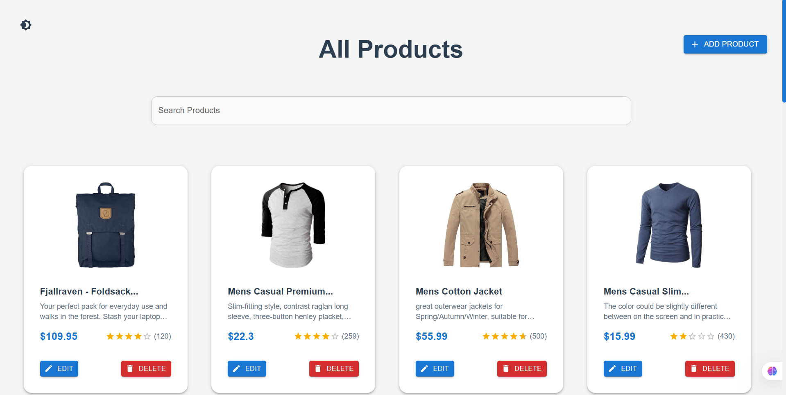

# Next-CRUD

A modern CRUD application built with Next.js, featuring a sleek UI and optimized performance.


.png)

## ✨ Features

- 🎯 Complete CRUD operations (Create, Read, Update, Delete)
- 🎨 Modern UI with Material-UI components
- 🌓 Dark/Light theme support
- 🔍 Advanced search with debounce optimization
- 💪 Performance optimized with React Hooks
- 🦴 Skeleton loading states
- 📱 Fully responsive design

## 🛠️ Built With

- [Next.js](https://nextjs.org/) - React framework
- [Material-UI](https://mui.com/) - UI component library
- [React Hooks](https://reactjs.org/docs/hooks-intro.html) - For state management
- REST API with Next.js API routes

## 🚀 Getting Started

### Prerequisites

- Node.js (version 14 or higher)
- npm or yarn

### Installation

1. Clone the repository
```bash
git clone https://github.com/your-username/Next-CRUD.git
```

##  Performance Optimizations
- Implemented useMemo for optimized product filtering
- Used useCallback for memoized delete operations
- Added debounce search functionality for better performance
- Integrated skeleton loading for improved user experience


## 🔧 Usage
- View Products : Browse through the list of products on the home page
- Add Product : Click the "Add Product" button to create a new product
- Search : Use the search bar to filter products
- Theme Toggle : Switch between light and dark modes
- Delete : Remove products with the delete button
## 🤝 Contributing
1. Fork the project
2. Create your feature branch ( git checkout -b feature/AmazingFeature )
3. Commit your changes ( git commit -m 'Add some AmazingFeature' )
4. Push to the branch ( git push origin feature/AmazingFeature )
5. Open a Pull Request

## 👤 Author
Youssef Ezzat
- GitHub: https://github.com/YoussefEzzat17
- LinkedIn: https://www.linkedin.com/in/youssef-ezzat17/
## 🌟 Acknowledgments
- Material-UI for the amazing component library
- Next.js team for the fantastic framework
- The React community for continuous inspiration